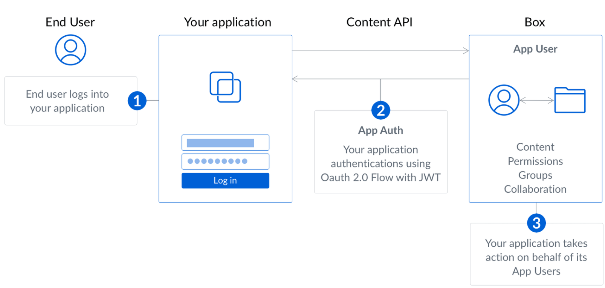

# demo-jwt

### Fluxo de Autenticação



### Como Executar

- Clonar o Repositório git:
```
git clone https://github.com/lebuffet02/jwt-spring3.git
```

- Construir o Projeto:
```
./mvnw clean package
```

- Executar:
```
java -jar ./target/jwt-0.0.1-SNAPSHOT.jar
```
